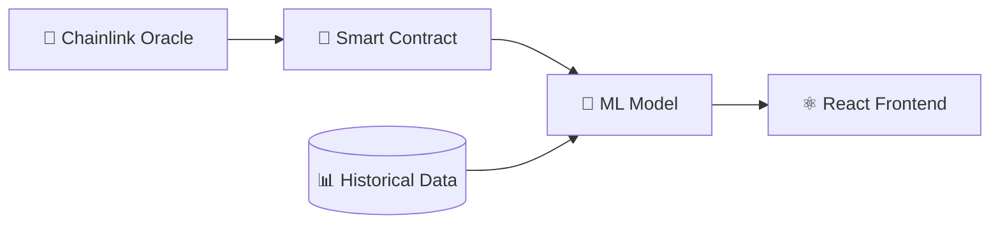

# 🤖 CrypTick

[](https://opensource.org/licenses/MIT)
[](https://docs.soliditylang.org/)
[](https://chain.link/)
[](https://reactjs.org/)
[](https://www.python.org/)
[](https://scikit-learn.org/)

A full-stack cryptocurrency pump and dump detection system combining blockchain oracles, machine learning, and real-time monitoring.

## 🏗️ System Architecture



## 🔍 Core Components

### 1. Machine Learning Engine 🤖
- 🌳 Random Forest Model
  - Feature Engineering
  - Historical Pattern Recognition
  - Real-time Prediction
  ```python
  from sklearn.ensemble import RandomForestClassifier
  model = RandomForestClassifier(
      n_estimators=100,
      max_depth=10,
      random_state=42
  )
  ```

### 2. Blockchain Integration 📜
- Smart Contract Monitoring
- Chainlink Oracle Integration
- Event Emission System

### 3. Frontend Dashboard ⚛️
- React-based UI
- Real-time Alerts
- Interactive Charts
- Performance Metrics

## 🚀 Quick Start

### Prerequisites

```markdown
- Node.js >= 14
- Python >= 3.9
- MetaMask wallet
- Testnet ETH
```

### Installation

1. Clone and Setup
```bash
# Clone repository
git clone https://github.com/yourusername/crypto-pump-detector.git
cd crypto-pump-detector

# Install dependencies
npm install   # Frontend
pip install -r requirements.txt  # ML Backend
```

2. Environment Setup
```bash
cp .env.example .env
# Configure your environment variables
```

## 🤖 ML Model Training

```python
# Train the model
python scripts/train_model.py --data-path ./data/historical_prices.csv
```

Features used:
- 📊 Price Volatility
- 📈 Volume Changes
- 🕒 Time-based Patterns
- 💹 Market Indicators

## ⚛️ Frontend Setup

```bash
# Start React development server
cd frontend
npm start
```

Key components:
```jsx
// Alert Component Example
const PumpDumpAlert = ({ data }) => (
  <div className="alert">
    <h3>🚨 Potential Pump & Dump Detected</h3>
    <p>Token: {data.symbol}</p>
    <p>Confidence: {data.confidence}%</p>
  </div>
);
```

## 📊 Dashboard Features

| Feature | Description | Icon |
|---------|-------------|------|
| Real-time Monitoring | Live price tracking | 📈 |
| ML Predictions | Random Forest analysis | 🤖 |
| Alert System | Instant notifications | 🚨 |
| Historical Analysis | Pattern tracking | 📊 |

## 🔧 Configuration

### ML Model Parameters
```python
MODEL_CONFIG = {
    'n_estimators': 100,
    'max_depth': 10,
    'min_samples_split': 5,
    'random_state': 42
}
```

### Smart Contract Settings
```javascript
const CONFIG = {
  PRICE_THRESHOLD: 10,    // 10% change
  VOLUME_THRESHOLD: 1000000,
  UPDATE_INTERVAL: 300
};
```

## 🧪 Testing

```bash
# Smart Contracts
npx hardhat test

# ML Model
python -m pytest tests/

# Frontend
npm test
```

## 📚 Documentation

- [ML Model Documentation](docs/ML.md)
- [Smart Contract Guide](docs/CONTRACTS.md)
- [Frontend Setup](docs/FRONTEND.md)
- [API Reference](docs/API.md)

## 🛡️ Security

- Secure Oracle Integration
- Model Validation Checks
- Rate Limiting
- Input Sanitization

## 🤝 Contributing

See [CONTRIBUTING.md](CONTRIBUTING.md) for details.

## 📄 License

MIT License - see [LICENSE.md](LICENSE.md)

## 🙏 Acknowledgments

- Chainlink for oracle services
- OpenZeppelin for contract templates
- scikit-learn for ML tools
- React team for frontend framework

## 📞 Contact

Your Name - [@yourtwitter](https://twitter.com/yourtwitter)

Project Link: [https://github.com/ShreyaR2/CrypTick]

---
⭐️ Star us on GitHub — it helps!

### ML Model Performance Metrics
```
Accuracy: 92%
Precision: 89%
Recall: 87%
F1 Score: 88%
```